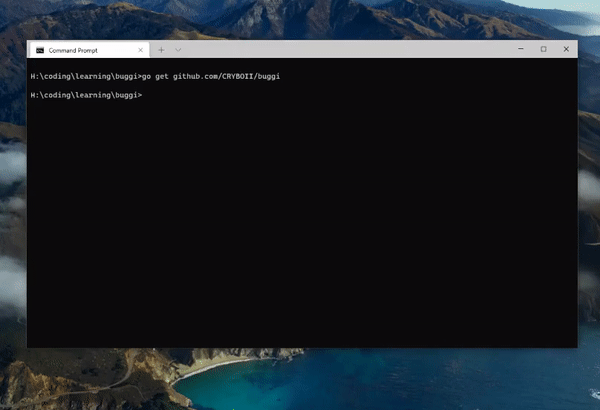

## Buggi - simple golang anti debugger & anti http debugging 

<p align="center">
	
</p>


 A simple golang package that will make a crackers feel more harder to reverse engineering your program, (for window os)

___

### What is Anti-Debugging 

Anti-Debugging techniques are meant to ensure that a program is not running under a debugger ,

and in the case that it is, to change its behavior correspondingly.

In most cases, the Anti-Debugging process will slow down the process of reverse engineering, 

but will not prevent it  [deepinstinct](https://www.deepinstinct.com/blog/common-anti-debugging-techniques-in-the-malware-landscape)


## INSTALL

```
go get github.com/CRYBOII/buggi
```

## USAGE
#### DetectAndClose - close program immediately when detected debugger
```
package main

import (
    "time"
    "github.com/CRYBOII/buggi"

)
func main() {
    // make a new tricker to invoke,and sent package to channel every 1 second (interval)
	ticker := time.NewTicker(1 * time.Second)
    // quit channel in the case you want to exist loop in goroutine function
	quit := make(chan struct{})
	go func() {
		for {
			select {
			case <-ticker.C:
                // use buggi fucntion when debugger is detected your program will close immediately 
				buggi.DetectAndClose()
			case <-quit:
				ticker.Stop()
				return
			}
		}
	}()

}


```
___
#### DetectAndReturn - return a name of debugger program as a string
```
// this will return a debugger name as a string type,if debugger program is opening
debugger := buggi.DetectAndReturn()

if debugger != "" {
// implement your own logic here
fmt.Printlh(debugger)
}

```

# RUN TEST

when package are intstalled you can run this command,
and try to open some debugger program for testing

#### List of debugger that can be detect
`BurpSuite,BurpSuiteFree,Charles,dumpcap,Fiddler,httpsMon,httpwatchstudiox64,mitmdump,mitmweb,NetworkMiner,Proxifier,rpcapd,smsniff,tshark,WinDump,Wireshark,WSockExpert,x96dbg,ollydbg,ida64,idag,idag64,idaw,idaw64,idaq,idaq64,idau,idau64,scylla_x64,scylla_x86,protection_id,windbg,reshacker,ImportREC,IMMUNITYDEBUGGER,HTTPDebuggerUI,HTTPDebuggerSvc,Debugger,OLLYDBG,ida,disassembly,scylla,Debug,CPU,Immunity,WinDbg,x32dbg,x64dbg,reconstructor,MegaDumper`

```
buggi
```



## NOTE !!
`anyways this method can be bypass by change a debugger program executable name `

___
MIT License

Copyright (c) 2021 JERA

Permission is hereby granted, free of charge, to any person obtaining a copy
of this software and associated documentation files (the "Software"), to deal
in the Software without restriction, including without limitation the rights
to use, copy, modify, merge, publish, distribute, sublicense, and/or sell
copies of the Software, and to permit persons to whom the Software is
furnished to do so, subject to the following conditions:

The above copyright notice and this permission notice shall be included in all
copies or substantial portions of the Software.

THE SOFTWARE IS PROVIDED "AS IS", WITHOUT WARRANTY OF ANY KIND, EXPRESS OR
IMPLIED, INCLUDING BUT NOT LIMITED TO THE WARRANTIES OF MERCHANTABILITY,
FITNESS FOR A PARTICULAR PURPOSE AND NONINFRINGEMENT. IN NO EVENT SHALL THE
AUTHORS OR COPYRIGHT HOLDERS BE LIABLE FOR ANY CLAIM, DAMAGES OR OTHER
LIABILITY, WHETHER IN AN ACTION OF CONTRACT, TORT OR OTHERWISE, ARISING FROM,
OUT OF OR IN CONNECTION WITH THE SOFTWARE OR THE USE OR OTHER DEALINGS IN THE
SOFTWARE.
